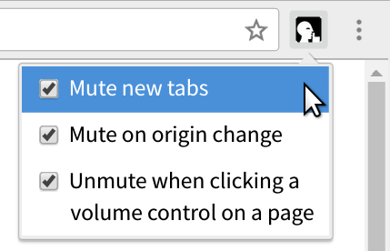

Mute all tabs by default
===
This is a Chrome extension that mutes the audio in all new tabs, until you
manually un-mute them by clicking the mute/un-mute icon in the tab.

It also mutes the tab when you navigate to a different origin.

It also injects a content script on {youtube, vimeo, soundcloud}.com that unmutes
the tab when you click on a volume control on the page.

All three features can be toggled in the extension's popup window:

**You must enable "Tab audio muting UI control" in `chrome://flags` to use this
extension; see the instructions below.**

Install
===
1.	Run Chrome on Linux, which is the only platform that lets you install an
	extension from source without seeing a nag popup every time you start the browser.

2.	`git clone https://github.com/ludios/mute-all-tabs-by-default`

3.	Open `chrome://flags/` in Chrome.

4.	Find <b>Tab audio muting UI control</b>, click "Enable", then restart Chrome.
	(Make sure to actually restart it, not just close one window.)

5.	Open `chrome://extensions/` in Chrome.

6.	Check "Developer mode" at the top-right.

7.	Click "Load unpacked extension...", then select the cloned `mute-all-tabs-by-default` directory.

8.	Check "Allow in incognito" if you also want incognito tabs to be muted by default.

Thanks
===
Thanks to https://openclipart.org/user-detail/rones for
https://openclipart.org/detail/219746/keep-quiet-sign, which I've used for the extension icon.
